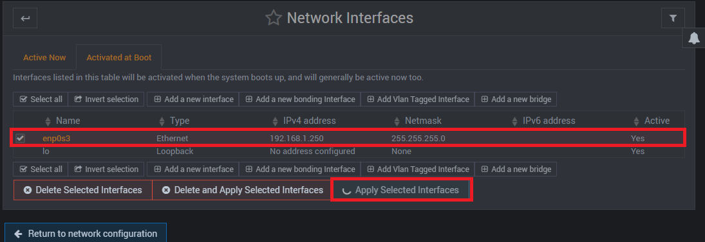

En esta página se explicará cómo instalar y configurar un servidor DNS sobre UbuntuServer 16.04.1, el servidor DNS que vamos a trabajar es Bind9.

***ÍNDICE***
           
1. Información y configuración de la(s) máquina(s) vírtual(es).
2. Instalación del servidor DNS usando Webmin.
3. Configuración DNS con Webmin. 

___

**NOTA:** Antes de la configuración del servidor DNS, debemos saber ya varias cosas que son:
* Tener varios equipos configurados y activos en la red (y todos ellos con una IP estática y nombres de la máquina).
* Saber el nombre de dominio que vamos a poner al servidor DNS, junto con la IP (también estática).

_Se ponen IPs estáticas para evitar conflictos de IP._
* Disponer de 2 servicios (subdominios, como apache2 y DNS). **??**
* Tener instalado y activo el servicio [Webmin](http://www.webmin.com/deb.html).

___

**1. INFORMACIÓN Y CONFIGURACIÓN DE LA(S) MÁQUINA(S) VIRTUAL(ES).**

Se necesitará 1 máquina virtual de UbuntuServer 16.04.1 y el sistema operativo anfitrión (u otra máquina virtual si no podemos cambiar la configuración de la red en la anfitrión, en mi caso usaré UbuntuServer 16.04.1 y mi equipo físico Windows 8.1).

 1.1.- Empezamos con la anfitrión (Windows 8.1):

   1.1.1- En la configuración de red, pondremos IP estática, gateway, etc. pero en el ServerDNS introduciremos la IP del UbuntuServer y en el alternativo un servidor DNS real, para traducir las direcciones ajenas de la red local.
 
 
   
   
   1.1.2- Aplicamos cambios y comprobamos que toda la configuración de la red que hemos hecho ahora, funcione.
   
   
   

*1.2.- Ahora con UbuntuServer, usaremos Webmin para configurar tanto la red, como el DNS.* 

__NOTA: EN CADA PASO, SE PINCHARÁ SÓBRE "Salvar" o similares, no se puso en los pasos por obviedad.__

   1.2.1- Primero escogeremos el menú "Redes" y luego en el submenú "configuración de la red" del Webmin.
   
  
  
  1.2.2- Después, seleccionaremos la opción de "Interfaces de red".
  
  
   1.2.3- Ahora, seleccionaremos la interfaz de la red  que vamos a configurar (en mi caso, enp0s3).
   
  
  
  1.2.4- Luego, configuraremos la interfaz con una IP estática y máscara de red.
 
  
  
  1.2.5- El siguiente paso, es partiendo desde el submenú "configuración de la red" vamos a entrar en el apartado "Enrutamiento y puertas de enlace".
  
  
  1.2.6- Posteriormente, ingresaremos la IP del gateway, en mi caso 192.168.1.1
   
  
  1.2.7- A continuación, partiendo desde el submenú "configuración de la red", ingresaremos en el apartado "Nombre de host y cliente DNS.
  
  

1.2.8- Ahora, configuramos el servidor DNS en "Servidores DNS" como primera opción asi mismo y luego un servidor DNS real, para traducir las direcciones ajenas de la red local. También en "Orden de resolución" ponemos como 1º opción "Archivos de host" y luego, "DNS". Y por último, en "Buscar dominios", seleccionaremos "Listado.." y debajo escribiremos el nombre de nuestro dominio DNS (en mi caso lounico.local ).

  

 1.2.9 Llegando casi al último paso, aplicaremos la configuración de la interfaz.
    

  1.2.10- Finalmente, vamos a la máquina de UbuntuServer y escribiremos el comando: ifconfig . Para comprobar que la configuración se aplicó correctamente.
  
  

  
**2. INSTALACIÓN DEL SERVIDOR DNS USANDO WEBMIN.**
   2.1- Para instalar el servidor DNS, debemos ir al menú "Módulos no utilizados" y accederemos al submenú "Servidor DNS BIND".
   
   

   2.2- Aquí simplemente le daremos a la casilla "Instalar ahora".
   
  
   2.3- Para ver si todo se instaló correctamente vamos nuevamente a "Módulos no utilizados" y luego a "Servidor DNS BIND". Debe haber 16 casillas de configuración, junto a 7 subcasillas debajo de estas.
  

 
**3. CONFIGURACIÓN DEL DNS CON WEBMIN.**
   3.1- Partiendo desde la imagen anterior, debemos darle a " "
     

   3.2
   
   
   3.3
   
   
   3.4
   
   
   3.5
   
   
   3.6
   
   
   3.7
   
   
   3.8
   
   
   3.9
   
   
   3.10
   
   
   3.11
   
