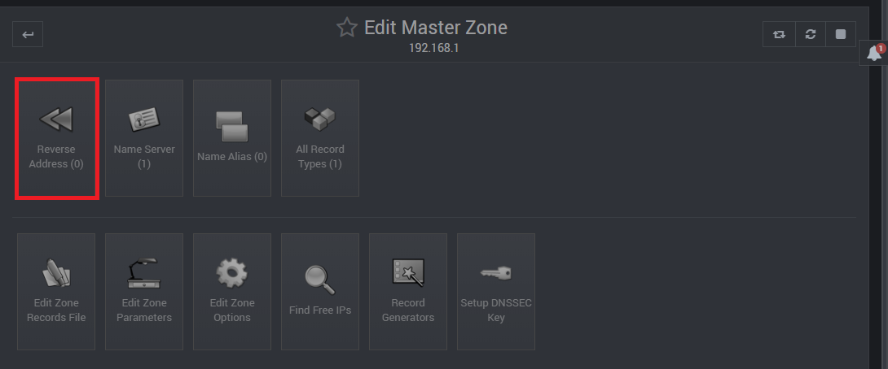
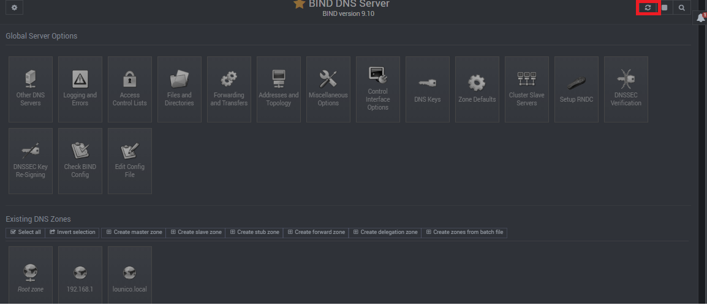
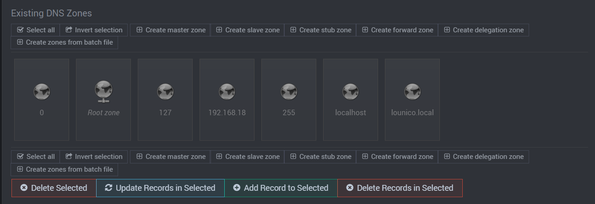

En esta página se explicará cómo configurar un servidor DNS de BIND9 sobre UbuntuServer 16.04.1 que previamente hemos instalado.

## ÍNDICE
[1. Información y configuración de la(s) máquina(s) virtual(es).](Material necesario.MD)

[2. Instalación del servidor DNS usando Webmin.](Instalación y comprobación.MD)

[3. Configuración del DNS con Webmin.](README.md)

[4. Comprobación de los errores sintácticos de la configuración del DNS empleando Webmin.](README.md)

___

**NOTA:** Antes de la configuración del servidor DNS, debemos saber ya varias cosas que son:
* Tener varios equipos configurados y activos en la red (y todos ellos con una IP estática y nombres de la máquina).
* Saber el nombre de dominio que vamos a poner al servidor DNS, junto con la IP (también estática).

_Se ponen IPs estáticas para evitar conflictos de IP._
* **¿¿¿¿** Disponer de 2 servicios (subdominios, como apache2 y Webmin). **????**
* Tener instalado y activo el servicio [Webmin](http://www.webmin.com/deb.html).

___
  
 
## 3. CONFIGURACIÓN DEL DNS CON WEBMIN.

### Crear Zona Directa.

   3.1- Partiendo la pantalla de configuración (del punto 2-3- Comprobar que la instalación del DNS se instaló correctamente), debemos darle a "Create master zone".
   
   

   3.2- **Registro NS** Ahora, configuramos la zona maestra: en "Zone type" lo pondremos en 'Forward (Name to Addresses)'. Después en: "Domain name / Network" escribiremos nuestro dominio (en mi caso lounico.local). Por último nos obligará poner algo en: "Email address", podemos escribir cualquier cosa para evadirlo si no queremos poner tu correo.
 

   
  
   3.3- **Registro A** Una vez creado la zona maestra, podemos visualizar todas las opciones de configuración de la zona maestra, de momento, le daremos a la casilla "Address(0)".
   
  

   3.4- Dentro de "Address(0)", procederemos a poner los nombres de los equipos en la variable "Name" junto con su respectiva IP privada en "Address".
   
  
   Crearemos varias más para poder probarlas más adelante.

Después de crear varias IP con los nombres, en la esquina superior derecha, nos encontraremos 2 botones; pulsaremos primero dónde dice: "Apply configuration luego en: "Apply zone", para salvar los cambios.

   
   
   3.5- Desde el menú de configuración de la zona maestra, le daremos a "Name Alias".
            
   
   3.6- **Registro CNAME** Ahora procederemos con los alias o CNAME. En "Name", escribiremos el nombre del subdominio y en "Real Name" pondremos el nombre que habíamos puesto en "Name" del menú "Address" de los pasos 3-3 y 3-4, pero alfinal añadimos el dominio.
 
   
   
   Una vez finalizada la creación de CNAME, le volvemos a dar primero dónde dice: "Apply configuration" luego en: "Apply zone", para salvar los cambios.
 

   3.7- **Registro MX** Casi llegando al último paso, vamos a hacer un registro MX (e-mail)
   
   

   3.8- Para terminar de configurar esta zona, nos situamos en la ventana de inicio de la zona y arriba a la izquierda, estarán los 2 botones para guardar la configuración.
   
  
  
### Crear Zona Inversa

   3.8- A continuación, crearemos otra zona maestra, pero esta será inversa NO le seleccionamos 'Forward (Name to Addresses)', si no, el otro el que dice 'Reverse (Addresses to Name)', en "Domain name / Network" escribiremos la dirección de red, pero sin la última sección (se quedará en 3 sección; 192.168.1).
 
 En "Master server", lo dejamos como está y pondremos el mismo correo electrónico en la variable "Email". 
   
  
   3.9- Posteriormente de crear la zona maestra inversa, podremos observar todas las casillas de configuración, hacemos click en "Reverse Addresses(0)".
   
   

   
   3.10- **Registro PTR** Ahora haremos justamente lo contrario al paso 3.4-, pondremos primero la dirección IP en "Address" y el nombre en "Hostname".
 
 
 Y procederemos nuevamente a salvar los cambios con las opciones: "Apply configuration" luego en: "Apply zone", para salvar los cambios.
   
   3.11- Por último paso, salvaremos la configuración desde el raíz del DNS (dónde hemos dado click en "create master zone".
    
   
   
  
## 4. COMPROBAR ERRORES SINTÁCTICOS EN LA CONFIGURACIÓN DNS EMPLEANDO WEBMIN.

Para comprobar si hay errores sintácticos en las zonas maestras del servidor DNS, debemos entrar primero en la configuración de una de las zonas maestras.

Para ir a las zonas maestras, iremos a la raíz del DNS y ahí podemos visualizar las zonas maestras creadas (tanto directa o inversa).
    

### Zona Directa:

Primero, debemos situarnos en la zona maestra directa (lounico.local) y dar clic en el botón: "Check Records".

   

Y como podemos ver, manda un mensaje de que no se han encontrado errores.

   

### Zona Inversa:

Para la zona inversa, es EXACTAMENTE lo mismo que en la zona directa, nos situamos en la zona maestra inversa (192.168.1) y le daremos a "Check Records".

  
  
  Y en la otra zona, tampoco hay errores como podemos visualizar en la siguiente fotografía.
  
  
  
  **OJO: ESTO SOLO CORRIJE SOLAMENTE ERRORES SINTÁCTICOS, SI TE EQUIVOCASTES A LA HORA DE ESCRIBIR LA IP O NOMBRE, NO TE LO DIRÁ.**
